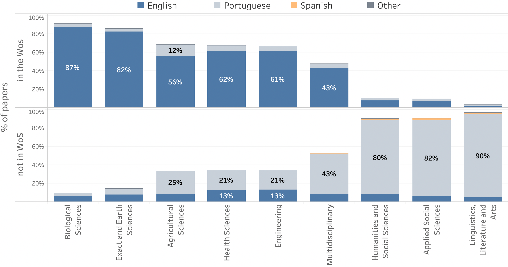

# Five schools of open science

Teste

Text

| School of thought | Central assumption | Central Aim |
| :--- | :--- | :--- |
| Democratic | The access to knowledge is unequally distributed. | Making knowledge freely available for everyone. |
| Pragmatic | Knowledge-creation could be more efficient if scientists worked together. | Opening up the process of knowledge creation. |
| Infrastructure | Efficient research depends on the available tools and applications. | Creating openly available platforms, tools and services for scientists. |
| Public | Science needs to be made accessible to the public. | Making science accessible for citizens. |
| Measurement | Scientific contributions today need alternative impact measurements. | Developing an alternative metric system for scientific impact. |

